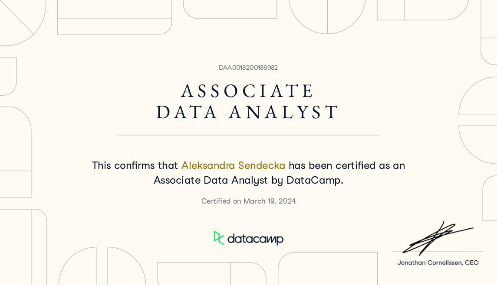
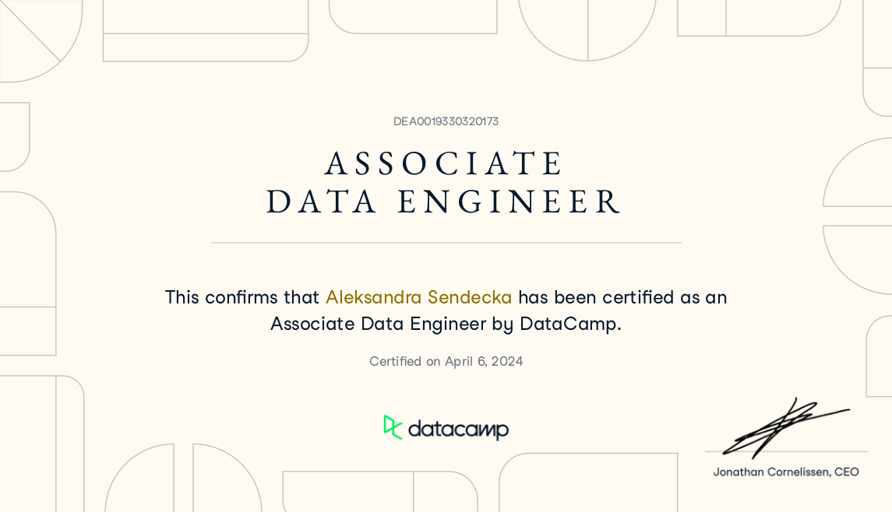

# My Certifications 📊 🎓 ✔️

## DataCamp - Data Scientist in Python Associate Certificate 📊

#### To get certified as a Data Scientist Associate, this candidate had to demonstrate that they have the knowledge, skills, and abilities to succeed at the entry level in this role. The competency domains assessed included, but were not limited to:

* Data Management - Getting data from a range of appropriate sources and resolving data issues, such as formats, handling missing data, reshaping and joining, and validating data.

* Exploratory Analysis - Using standard manipulation and visualization techniques to learn more about the data available and insights that may be gained. Preparing data for further analysis and modeling including the creation of new features.

* Statistical Experimentation - Using data and relevant statistical approaches to perform experiments.

* Modeling - Developing predictive models using appropriate machine learning techniques for the data and task at hand. Performing all elements of the model development workflow from initial fit to model validation and parameter tuning.

* Programming for Data Science - Being able to write reusable code to solve data problems. Identifying when problems have occurred and resolved them effectively, ultimately resulting in a process suitable for production environments for solving data challenges.

* Communication and Visualization - Presenting data in reports or dashboards to make available to stakeholders and clearly presenting actionable analytic results to business problems.

We tested the candidate's skills rigorously through:

#### Timed exams

Through a series of questions on a range of topics, we are able to establish that this individual has the knowledge required for a data analyst role. We make use of adaptive testing approaches to understand to a high degree of confidence the skill level of individuals who take the assessments.

#### Practical exam submission

This stage of the certification is graded manually and stringently by our data experts. The candidate must complete a written report that addresses a business problem. In this report, they’ve selected appropriate visualizations, fitted and evaluated a model, and effectively defended their decisions.

## DataCamp - Data Analyst Associate Certificate 📊

#### To get certified as a Data Analyst Associate, this candidate had to demonstrate that they have the knowledge, skills, and abilities to succeed at the entry level in this role. The competency domains assessed included, but were not limited to:

* Data Management - At the level of data analyst, data management tasks relate mostly to data cleaning and processing. This includes identifying data quality issues, performing transformations and being able to work with data from multiple sources, typically multiple database tables. For the large part, these tasks are performed in SQL. This skill was tested through a hands-on SQL coding challenge. The individual was required to code specific cleaning and transformation tasks that can be applied to a given data source.

* Exploratory Analysis - From specific business questions to more general exploration, being able to approach a problem, find the right data and get it into the right format is the core work of a data analyst. This candidate was comfortable in everything from creating summaries of data to transforming data into relevant formats for generating reports and dashboards. This skill was primarily tested through a hands-on SQL coding challenge but assessment was also supplemented through a test in either R or Python.

* Statistical Experimentation - Using data and relevant statistical approaches to perform experiments.

* Communication and Visualization - As a direct line between business stakeholders and the data, it is essential to be able to effectively communicate insights. Creating dashboards, reports and presentations are all day to day aspects of the data analysts role. While the tools to do this may vary widely, the ability to create strong representations of the data through tables and visualizations and being able to effectively talk through findings, are essential at all levels.

We tested the candidate's skills rigorously through:

#### Timed exams

Through a series of questions on a range of topics, we are able to establish that this individual has the knowledge required for a data analyst role. We make use of adaptive testing approaches to understand to a high degree of confidence the skill level of individuals who take the assessments.

#### Practical exam submission

This stage of the certification is graded manually and stringently by our data experts. The candidate must complete a written report that addresses a business problem. In this report, they've selected appropriate visualizations and effectively defended their analysis.

## DataCamp - Data Engineer Associate Certificate 📊

#### To get certified as a Data engineer Associate, this candidate had to demonstrate that they have the knowledge, skills, and abilities to succeed at the entry level in this role. The competency domains assessed included, but were not limited to:

* Data Management - Central to the work of an entry level data engineer, data management requires that individuals are able to get the right data and ensure that it is clean and of a quality fit for further analysis and decision making. These tasks will require strong SQL skills, but data engineers should also be able to complete them in Python. This skill was tested through timed exams in SQL, theory and Python, as well as a hands on practical exam using SQL. The individual was required to solve a series of problems related to a real world situation, that included cleaning data and preparing data into a format suitable for further analysis.

* Programming for Data Engineering - Data engineers need to make sure that data is available to others within an organization, and any preparation tasks are performed to a regular schedule to enable decision making. Having a strong grasp of programming techniques enables them to schedule regular tasks, ensure they are performed efficiently and in a scalable manner. At entry level this requires strong Python programming skills. This skill was tested through a timed exam in Python.

* Exploratory Analysis - Data engineers will find themselves working regularly with data analysts, data scientists and others wanting to gather insights from the data they are providing. Having a high level view of the most common ways of working with data will enable them to be more effective and foresee potential problems. This skill was test through a timed exam testing theoretical knowledge.

We tested the candidate's skills rigorously through:

#### Timed exams

Through a series of questions on a range of topics, we are able to establish that this individual has the knowledge required for a data engineer role. We make use of adaptive testing approaches to understand to a high degree of confidence the skill level of individuals who take the assessments.

#### Practical exam submission

This stage of the certification allows the candidate to demonstrate that they are able to put together their skills to solve problems they will experience in the real world. The candidate must complete a series of tasks to clean and prepare data, and result in the correct data.
